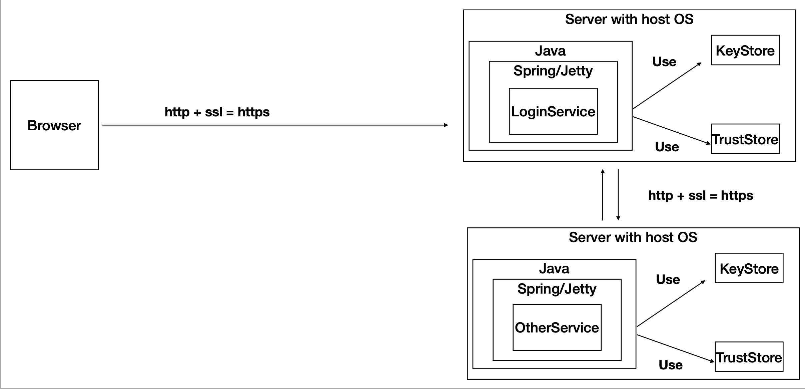
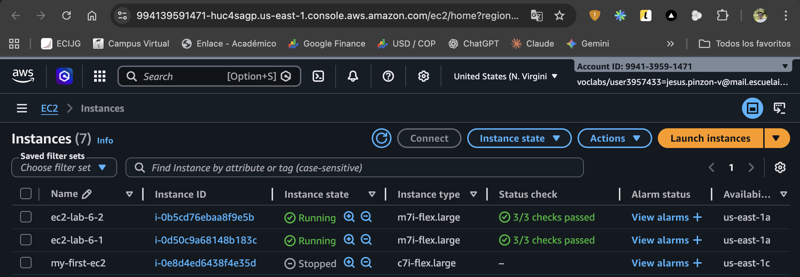
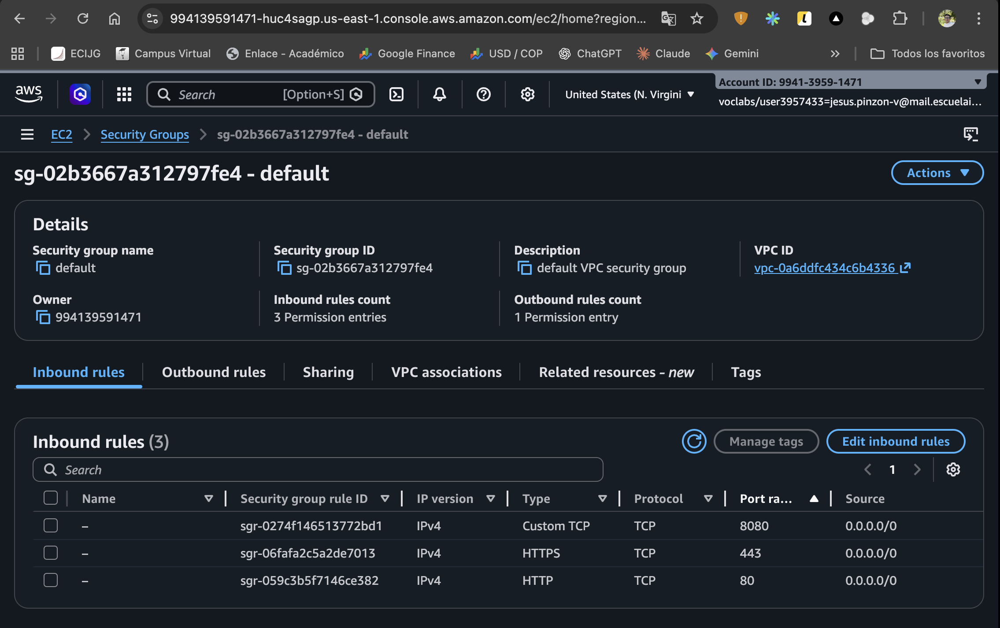
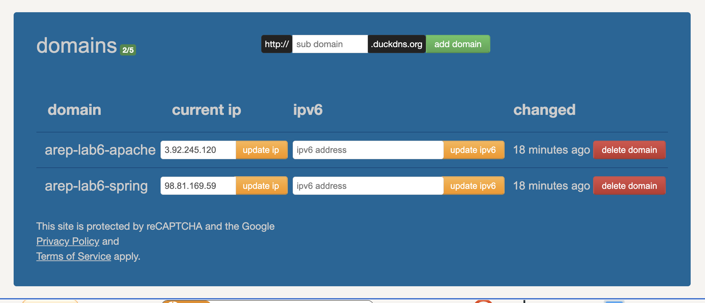
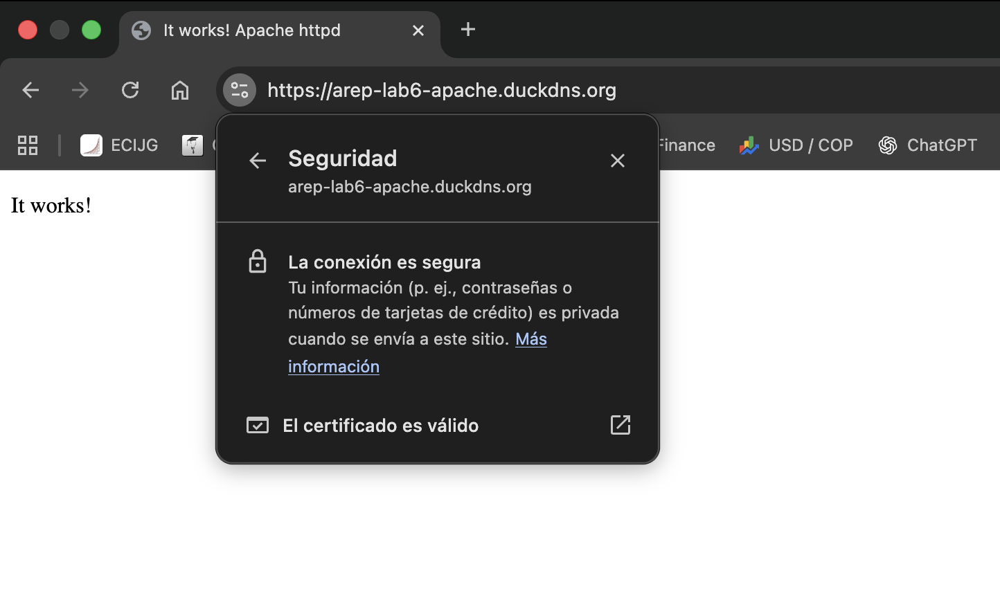
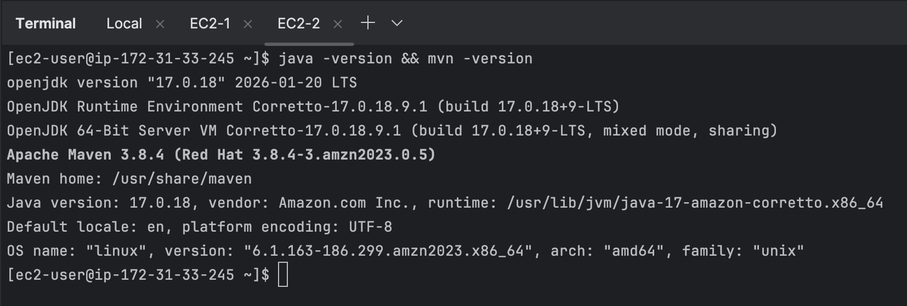
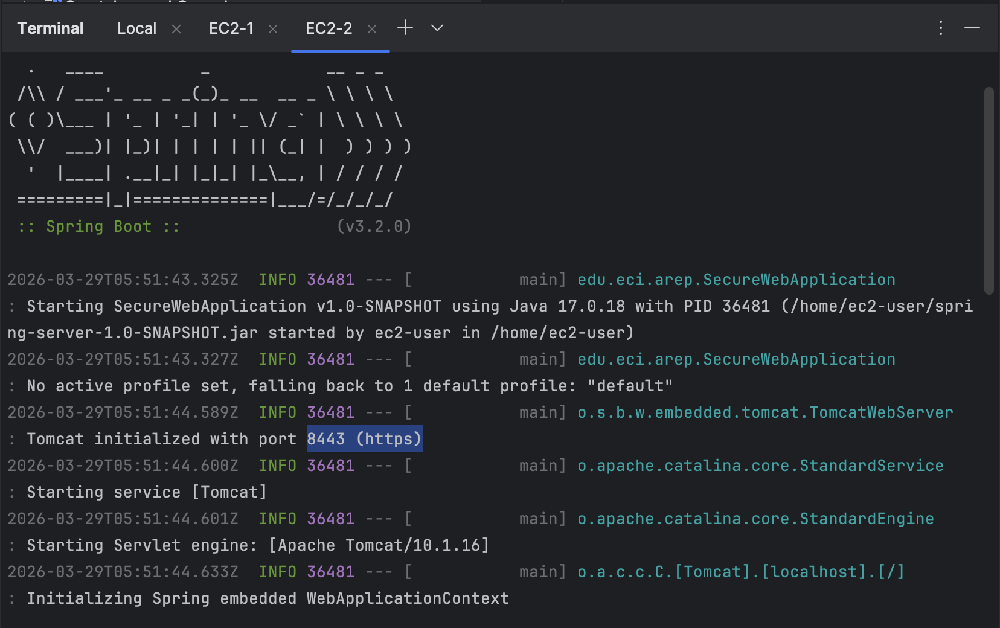
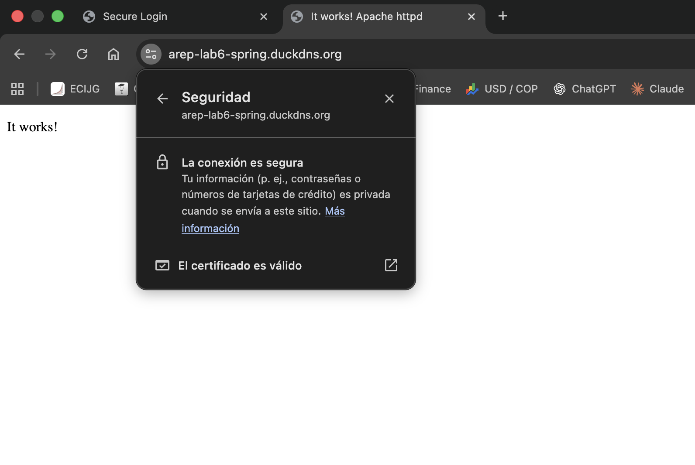
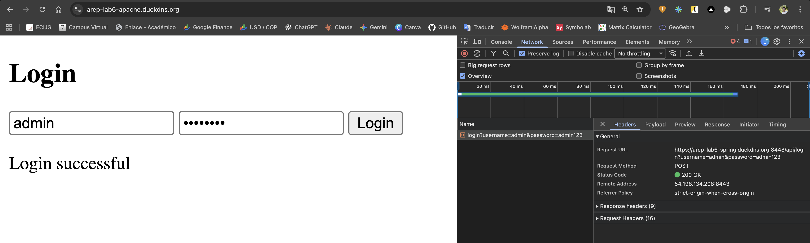
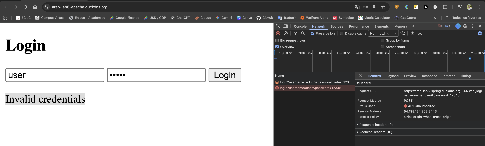

# 🔐 Secure Application Design

[](https://www.oracle.com/java/)
[](https://spring.io/projects/spring-boot)
[](https://httpd.apache.org/)
[](https://letsencrypt.org/)
[](https://aws.amazon.com/ec2/)
[](https://maven.apache.org/)
[](LICENSE)

> **Enterprise Architecture (AREP)** — Laboratory 6  
> Design and deployment of a secure, scalable web application on AWS using TLS encryption, Let's Encrypt certificates, and hashed password authentication across two independent EC2 servers.

---

## 📋 **Table of Contents**

- [Overview](#-overview)
- [Architecture](#-architecture)
- [Security Features](#-security-features)
- [Project Structure](#-project-structure)
- [Prerequisites](#-prerequisites)
- [AWS EC2 Deployment](#-aws-ec2-deployment)
- [Running the Application](#-running-the-application)
- [API Reference](#-api-reference)
- [Screenshots](#-screenshots)
- [Demo Video](#-demo-video)
- [Author](#-author)
- [License](#-license)
- [Additional Resources](#-additional-resources)

---

## 🌐 **Overview**

This laboratory implements a **two-server secure web architecture** deployed on AWS EC2, demonstrating enterprise-grade security practices:

- **Server 1 (Apache):** Serves an asynchronous **HTML + JavaScript** login client over HTTPS, using a valid TLS certificate issued by [Let's Encrypt](https://letsencrypt.org/) via the `arep-lab6-apache.duckdns.org` domain.
- **Server 2 (Spring Boot):** Exposes a **RESTful login API** over HTTPS on port `8443`, protected by a PKCS12 keystore derived from a Let's Encrypt certificate via the `arep-lab6-spring.duckdns.org` domain.

The client, served from Apache, invokes the Spring REST API **asynchronously** from the browser using the Fetch API, completing a full end-to-end encrypted communication flow.

---

## 🏗️ **Architecture**



*Two-server secure architecture: Apache serves the HTML client; Spring Boot handles authentication via HTTPS*

```
Browser
   │
   │  HTTPS (port 443) — TLS via Let's Encrypt
   ▼
┌──────────────────────────────────┐
│            EC2 #1                │
│        Apache HTTP Server        │  ← Serves HTML + JS login client
│   arep-lab6-apache.duckdns.org   │
│         KeyStore + TLS           │
└──────────────────────────────────┘
            │
            │  HTTPS (port 8443) — Fetch API (async)
            ▼
┌──────────────────────────────────┐
│            EC2 #2                │
│        Spring Boot REST API      │  ← Handles login authentication
│   arep-lab6-spring.duckdns.org   │
│    LoginController + LoginService│
│  PKCS12 KeyStore (Let's Encrypt) │
└──────────────────────────────────┘
```

---

## 🔒 **Security Features**

- **TLS Encryption:** Both servers use valid, browser-trusted certificates issued by **Let's Encrypt** via [Duck DNS](https://www.duckdns.org/) free subdomains
- **PKCS12 KeyStore:** The Spring server loads its certificate from a PKCS12 file generated with the `-legacy` flag for Java 17 compatibility
- **Password Hashing:** User passwords are stored and compared as **SHA-256 hashes** — plain-text passwords are never persisted
- **Asynchronous Client:** The HTML+JS client communicates with the REST API using the **Fetch API** without any external libraries
- **CORS Configuration:** The Spring controller allows cross-origin requests from the Apache client via `@CrossOrigin`
- **12-Factor Config:** Server port is read from the `PORT` environment variable, defaulting to `8443`

---

## 📁 **Project Structure**

```
AREP-laboratory-6-secure-application-design/
├── LICENSE
├── README.md
├── assets/
│   ├── docs/
│   │   └── AREP-L6.pdf
│   ├── images/
│   └── videos/
│       └── secure-app-video-demo.mov
├── apache-client/
│   └── index.html
└── spring-server/
    ├── pom.xml
    └── src/main/
        ├── java/edu/eci/arep/
        │   ├── SecureWebApplication.java
        │   ├── controller/
        │   │   └── LoginController.java
        │   └── service/
        │       └── LoginService.java
        └── resources/
            ├── application.properties
            └── keystore/
                └── ecikeystore.p12
```

---

## ✅ **Prerequisites**

- **Java 17** (Amazon Corretto recommended)
- **Maven 3.8+**
- **Git**
- Two **AWS EC2** instances running *Amazon Linux 2023*
- Ports `22`, `80`, `443`, and `8443` open in the Security Group
- A free [Duck DNS](https://www.duckdns.org/) account with two subdomains

---

## ☁️ **AWS EC2 Deployment**

### Server 1 — Apache with Let's Encrypt

#### 1. Connect to EC2 #1

```bash
ssh -i "my-key.pem" ec2-user@<EC2_APACHE_IP>
```

#### 2. Install Apache, SSL module, and Certbot

```bash
sudo dnf update -y
sudo dnf install -y httpd mod_ssl gcc augeas-libs augeas-devel libxml2-devel python3-devel
sudo systemctl start httpd
sudo systemctl enable httpd
sudo pip3 install --upgrade certbot certbot-apache
```

#### 3. Create Duck DNS domain and configure VirtualHost

In [duckdns.org](https://www.duckdns.org), create `arep-lab6-apache` pointing to the EC2 #1 public IP. Then:

```bash
sudo bash -c 'cat > /etc/httpd/conf.d/arep-lab6-apache.conf << EOF
<VirtualHost *:80>
    ServerName arep-lab6-apache.duckdns.org
    DocumentRoot /var/www/html
</VirtualHost>
EOF'
sudo systemctl restart httpd
sudo certbot --apache -d arep-lab6-apache.duckdns.org
```

#### 4. Deploy the HTML client

```bash
sudo chmod 777 /var/www/html/
```

From your local machine:
```bash
sftp -i "my-key.pem" ec2-user@<EC2_APACHE_IP>
put apache-client/index.html /var/www/html/index.html
```

---

### Server 2 — Spring Boot with Let's Encrypt + PKCS12

#### 1. Connect to EC2 #2

```bash
ssh -i "my-key.pem" ec2-user@<EC2_SPRING_IP>
```

#### 2. Install Java, Maven, Apache and Certbot

```bash
sudo dnf install -y java-17-amazon-corretto maven httpd mod_ssl gcc augeas-libs augeas-devel libxml2-devel python3-devel
sudo systemctl start httpd && sudo systemctl enable httpd
sudo pip3 install --upgrade certbot certbot-apache
```

#### 3. Create Duck DNS domain and configure VirtualHost

In [duckdns.org](https://www.duckdns.org), create `arep-lab6-spring` pointing to the EC2 #2 public IP. Then:

```bash
sudo bash -c 'cat > /etc/httpd/conf.d/arep-lab6-spring.conf << EOF
<VirtualHost *:80>
    ServerName arep-lab6-spring.duckdns.org
    DocumentRoot /var/www/html
</VirtualHost>
EOF'
sudo systemctl restart httpd
sudo certbot --apache -d arep-lab6-spring.duckdns.org
```

#### 4. Convert PEM certificate to PKCS12

```bash
sudo openssl pkcs12 -export \
  -in /etc/letsencrypt/live/arep-lab6-spring.duckdns.org/fullchain.pem \
  -inkey /etc/letsencrypt/live/arep-lab6-spring.duckdns.org/privkey.pem \
  -out /tmp/ecikeystore.p12 \
  -name ecikeypair \
  -passout pass:123456 \
  -legacy

sudo chmod 644 /tmp/ecikeystore.p12
```

Download from your local machine:
```bash
sftp -i "my-key.pem" ec2-user@<EC2_SPRING_IP>
get /tmp/ecikeystore.p12 spring-server/src/main/resources/keystore/ecikeystore.p12
```

#### 5. Build and upload the JAR

```bash
cd spring-server
mvn clean package -DskipTests
```

```bash
sftp -i "my-key.pem" ec2-user@<EC2_SPRING_IP>
put spring-server/target/spring-server-1.0-SNAPSHOT.jar /home/ec2-user/
```

---

## 🚀 **Running the Application**

### Start the Spring Boot server on EC2 #2

```bash
ssh -i "my-key.pem" ec2-user@<EC2_SPRING_IP>
java -jar spring-server-1.0-SNAPSHOT.jar
```

### Access the login client

```
https://arep-lab6-apache.duckdns.org
```

### Test credentials

| Field | Value |
|-------|-------|
| **Username** | `admin` |
| **Password** | `admin123` |

---

## 📡 **API Reference**

### `POST /api/login`

Authenticates a user by comparing the SHA-256 hash of the submitted password against the stored hash.

| Parameter | Type | Description |
|-----------|------|-------------|
| `username` | `String` | The account username |
| `password` | `String` | The plain-text password (hashed internally) |

**Success — `200 OK`:**
```
Login successful
```

**Failure — `401 Unauthorized`:**
```
Invalid credentials
```

**Example:**
```bash
curl -k -X POST "https://arep-lab6-spring.duckdns.org:8443/api/login?username=admin&password=admin123"
```

---

## 📸 **Screenshots**

### EC2 Instances Running



*Two EC2 instances in running state on AWS Console — Apache (EC2-lab6-1) and Spring (EC2-lab6-2) servers*

---

### Security Group Inbound Rules



*Inbound rules allowing SSH (22), HTTP (80), HTTPS (443), and custom TCP ports 8080 and 8443*

---

### Duck DNS Domains Configured



*Both subdomains — `arep-lab6-apache` and `arep-lab6-spring` — pointing to their respective EC2 public IPs*

---

### Apache Server — HTTPS with Valid Certificate



*`https://arep-lab6-apache.duckdns.org` served over HTTPS with a valid Let's Encrypt certificate*

---

### Java and Maven Installed on EC2 #2



*Java 17 (Amazon Corretto) and Apache Maven 3.8.4 confirmed on EC2 #2*

---

### Spring Boot Server Running on EC2 #2



*Spring Boot application started successfully on port `8443` (HTTPS)*

---

### Spring Server — HTTPS with Valid Certificate



*`https://arep-lab6-spring.duckdns.org` validated with a trusted Let's Encrypt certificate*

---

### Login Successful



*Client served from Apache successfully authenticates against the Spring REST API over HTTPS — `200 OK` with "Login successful"*

---

### Login Failure — Invalid Credentials



*Invalid credentials correctly rejected with `401 Unauthorized` and "Invalid credentials" message*

---

## 🎬 **Demo Video**

> A demonstration video showing the full secure application in operation — HTTPS on both servers, login success, and login failure — is available at:

📎 [Watch Demo Video](assets/videos/secure-app-video-demo.mov)

---

## 👥 **Author**

<table>
  <tr>
    <td align="center">
      <a href="https://github.com/JAPV-X2612">
        
        <br />
        <sub><b>Jesús Alfonso Pinzón Vega</b></sub>
      </a>
      <br />
      <sub>Full Stack Developer</sub>
    </td>
  </tr>
</table>

---

## 📄 **License**

This project is licensed under the **Apache License, Version 2.0** — see the [LICENSE](LICENSE) file for details.

---

## 🔗 **Additional Resources**

- [Spring Boot Documentation](https://docs.spring.io/spring-boot/docs/current/reference/html/)
- [Let's Encrypt Documentation](https://letsencrypt.org/docs/)
- [Certbot on Amazon Linux](https://certbot.eff.org/instructions?sysconfig=pip&os=pip)
- [Apache HTTP Server Documentation](https://httpd.apache.org/docs/)
- [Duck DNS](https://www.duckdns.org/)
- [AWS EC2 User Guide — Amazon Linux 2023](https://docs.aws.amazon.com/linux/al2023/ug/what-is-amazon-linux.html)
- [PKCS12 Key Store — Java SE 17](https://docs.oracle.com/en/java/docs/api/java.base/java/security/KeyStore.html)
- [SHA-256 MessageDigest — Java SE 17](https://docs.oracle.com/en/java/docs/api/java.base/java/security/MessageDigest.html)
- [12-Factor App Methodology](https://12factor.net/)
- [TLS/SSL Overview — MDN](https://developer.mozilla.org/en-US/docs/Web/Security/Transport_Layer_Security)